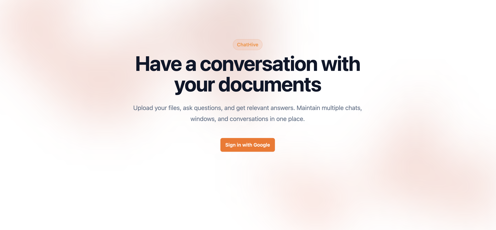
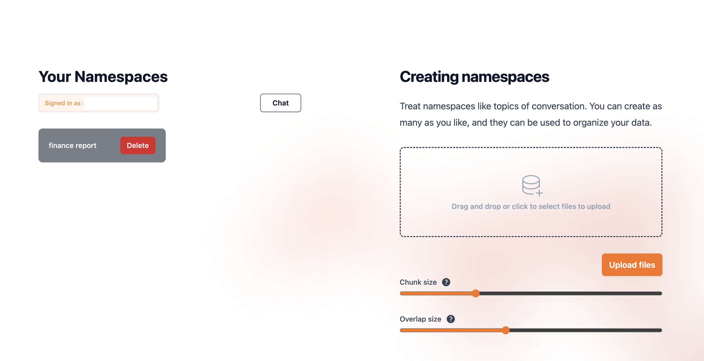

# **ChatHive: Conversational AI with GPT-4, Pinecone, LangChain, and MongoDB**

ChatHive is a powerful AI-driven chatbot application designed for interactive document-based conversations. Leverage GPT-4 for conversational intelligence, Pinecone for vector-based document retrieval, MongoDB for scalable chat history storage, and a modern frontend built with Next.js, React, and TailwindCSS.  

🚀 **Deployed Version:** _(Access restricted to maintain API key security. Follow instructions below to run or deploy your own instance.)_

---

## **Features**
- **Multi-Topic Conversations:** Create and manage multiple topics to chat about.  
- **Document Uploads:** Upload `.pdf`, `.docx`, or `.txt` files for AI-based retrieval and discussions.  
- **Embedded Storage:** Automatically convert files to embeddings and store them in Pinecone namespaces.  
- **Chat Management:** Maintain multiple chats per topic with automatic MongoDB-based history retrieval.  
- **Integrated OAuth:** Google OAuth for secure user login and personalized chat storage.  
- **In-Browser Management:** Create, manage, and delete Pinecone namespaces directly from the browser.  

---

### **Tech Stack**


> **Backend Tools:** LangChain, Pinecone, OpenAI GPT-4.  
> **Frontend:** Fully responsive design with TailwindCSS.

---

## **Screenshots**

### **Main Chat Interface**


### **Settings Page**


---

## **Getting Started**

Follow the instructions below to set up and run ChatHive locally.

### **1. Clone the Repository**

```bash
git clone https://github.com/dissorial/doc-chatbot.git --branch mongodb-and-auth

```

## **Pinecone Setup**
1. Create an account on [Pinecone](https://www.pinecone.io/).
2. Go to **Indexes** > **Create Index**:
   - **Name:** Choose any name.
   - **Dimensions:** Set to `1536` (required for OpenAI embeddings).
   - Leave other fields as default.
3. Navigate to **API Keys** and create a new key.
4. Save the **API Key** and **Environment** values.

---

## **MongoDB Setup**
1. Create an account on [MongoDB](https://www.mongodb.com/).
2. In your dashboard:
   - Click **New Project** > **Create Project**.
   - Under **Database Deployments**, click **Build a Database**:
     - Choose **M0 FREE** for a free-tier cluster.
     - Fill out cluster details and click **Create**.
   - Add your **current IP address** to the access list.
   - Under **Connect** > **Drivers**, copy the **MongoDB URI**.
3. Replace `<password>` in the URI with the password you set for your database user.

---

## **Google OAuth Setup**
1. Go to [Google Developer Console](https://console.cloud.google.com/) and create a new project.
2. Under **APIs & Services**:
   - Go to **OAuth Consent Screen** > **External** > Fill out details.
   - Add `.../auth.userinfo.email` scope.
   - Add yourself as a **Test User**.
3. Under **Credentials**:
   - Create **OAuth Client ID**:
     - **Authorized JavaScript Origins:** `http://localhost:3000`
     - **Authorized Redirect URIs:** `http://localhost:3000/api/auth/callback/google`
   - Save the **Client ID** and **Client Secret**.

---

## **Install Dependencies**
```bash
yarn install

```

## **Run the App**

1. Run the following command to start the development server:

```bash
npm run dev

```

2. Once the local development environment launches, you can access the app at http://localhost:3000.


## **Using the App**

### **Chat with Files**

1. After logging in with Google, go to Settings at the bottom left corner.
2. Upload your files and assign them a namespace. In this context, a namespace is synonymous with the topic of your conversation.
3. You can upload multiple files to different namespaces and maintain multiple conversations about various topics and documents.

### **Main Chat Area**
1. On the home page, you will see your namespace(s) on the left sidebar.
2. Click on a namespace to open it, create a new chat, and start a conversation with the files embedded for that particular namespace.


## **Troubleshooting**

### **General Errors**

1. Ensure your Node.js version is up-to-date by running node -v.
2. If you're encountering issues with a specific file, try converting it to text first or use a different file. It's possible that the file is corrupted, scanned, or requires OCR (Optical Character Recognition) to convert it to text.
3. Double-check your environment variables and make sure they are properly exposed and configured.
4. Ensure you're using the correct versions of LangChain and Pinecone as required by this repository.
5. Verify that your .env file contains valid API keys, environment settings, and index names.

### **Pinecone Errors**

1. Ensure that your Pinecone dashboard environment and index match the values you provided in your .env file.
2. Confirm that the vector dimensions are set to 1536 as required by OpenAI embeddings.
3. If you're on the Starter (free) plan, be aware that Pinecone indexes are deleted after 7 days of inactivity. To prevent this, send an API request to Pinecone to refresh activity before the 7-day period ends.
4. If issues persist, try starting fresh with a new Pinecone project, index, and a cloned repository.

## **Credits**

1. The frontend of this repository is inspired by the GPT-4 & LangChain repository by mayooear.
2. Significant customizations have been made to enhance features and integrations for this specific project.